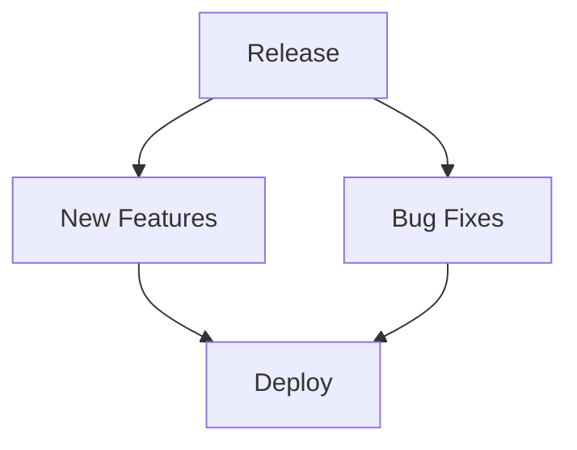

## Overview

Stay updated with the latest releases of Nick Hanson Documentation. You access new features, improvements, and bug fixes through these changelog entries. Review changes by version to understand updates to your documentation space.

<Columns cols={3}>
  <Card title="Get Started" icon="book-open" href="/docs/getting-started">
    Set up your documentation in minutes.
  </Card>
  <Card title="Features" icon="star" href="/docs/features">
    Explore all available features.
  </Card>
  <Card title="Contribute" icon="github" href="/docs/contribute" target="_blank">
    Help improve the platform.
  </Card>
</Columns>

## Recent Releases

<Update label="2024-10-15" description="v1.3.0" tags={["feature", "improvement"]}>

## New Features

- Added real-time collaboration for shared documentation editing.
- Introduced custom brand color support, like `#3B82F6` for your themes.

## Improvements

- Enhanced search performance by `>30%` for large documentation sites.
- Updated MDX parsing to handle nested `{components}` more reliably.

## Bug Fixes

- Fixed parsing errors with unescaped `<` and `>` in prose text.
- Resolved line number display issues in `<CodeGroup>` components.

<CodeGroup tabs="Before,After">
  ```javascript
  // Before: Potential parsing error
  if (response.time < 100ms) {
    console.log("Fast");
  }
  ```
  ```javascript
  // After: Properly escaped
  if (response.time `<100ms`) {
    console.log("Fast");
  }
  ```
</CodeGroup>

</Update>

<Update label="2024-09-25" description="v1.2.0" tags={["feature", "bugfix"]}>

## New Features

- Integrated `<Tabs>` and `<Steps>` components for better tutorials.
- Added `<ParamField>` for structured API documentation.

## Bug Fixes

- Corrected Mermaid diagram rendering (now uses code blocks only).
- Fixed attribute quoting in JSX components to enforce double quotes.

<Callout kind="tip">
  Test your MDX files after updating to ensure compatibility.
</Callout>

</Update>

<Update label="2024-08-10" description="v1.1.0" tags={["breaking", "feature"]}>

## Breaking Changes

- Removed deprecated `<Mermaid>` component; use ````mermaid` code blocks instead.

## New Features

- Launched `<Update>` components for changelog pages.
- Supported Lucide icons like `zap` and `shield` in all components.

## Improvements

- Optimized image loading with required `width` and `height` attributes.



</Update>

## Stay Updated

Follow these steps to contribute changelog entries or track changes:

<Steps>
  <Step title="Fork Repository" icon="github">
    Fork the Nick Hanson Documentation repo on GitHub.
  </Step>
  <Step title="Add Update" icon="edit-3">
    Create a new `<Update>` component with your changes.
  </Step>
  <Step title="Test MDX" icon="check-circle">
    Validate parsing with no `{}` or `<>` errors in prose.
  </Step>
  <Step title="Submit PR" icon="git-pull-request">
    Open a pull request with details.
  </Step>
</Steps>

<Tabs>
  <Tab title="Subscribe" icon="bell">
    Join the newsletter for release notifications.
  </Tab>
  <Tab title="RSS Feed" icon="rss">
    Add `/changelog.xml` to your RSS reader.
  </Tab>
</Tabs>

<ExpandableGroup>
  <Expandable title="Older Versions" default-open="false">
    View v1.0.0 and earlier in the full history.
  </Expandable>
</ExpandableGroup>