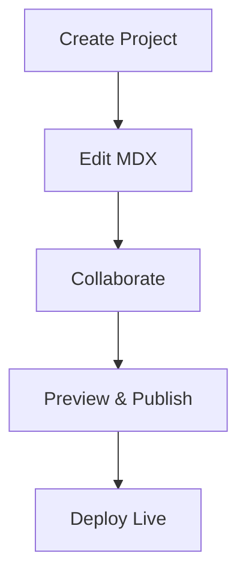

## Overview

Organize your project documentation efficiently using Nick Hanson Documentation. You create projects, edit MDX files directly, and collaborate with team members through version control and previews. This guide covers essential workflows to keep your docs structured and up-to-date.

<Callout kind="tip">
  Start with a clear folder structure: use `docs/` for main content, `components/` for custom elements, and `public/` for assets.
</Callout>

## Creating Projects

Set up new documentation spaces for each project to maintain separation.

<Steps>
  <Step title="Sign In" icon="log-in">
    Access your dashboard at `https://docs.nickhanson.io` and click **New Project**.
  </Step>
  <Step title="Configure Basics" icon="settings">
    Enter project name like `MyApp Docs`, select brand color `#3B82F6`, and choose MDX template.
  </Step>
  <Step title="Add Initial Files" icon="file-plus">
    Upload your `README.mdx` or create folders: `guides/`, `api/`, `changelog.mdx`.
  </Step>
  <Step title="Publish Preview" icon="eye">
    Save changes to generate a live preview URL for review.
  </Step>
</Steps>

## Editing Content

Edit MDX files with syntax highlighting and live previews. Use the built-in editor for quick changes.

<Tabs>
  <Tab title="Visual Editor" icon="edit-3">
    Drag-and-drop components like `<Card>` or `<Steps>`. Preview renders instantly.

    <Image
      src="https://via.placeholder.com/800x400/3B82F6/white?text=Visual+Editor"
      alt="Visual editor interface showing MDX components"
      width="800"
      height="400"
    />
  </Tab>
  <Tab title="Code Editor" icon="code">
    Write raw MDX with full IntelliSense.

    <CodeGroup tabs="MDX,Markdown">
```mdx
---
title: API Guide
description: Endpoints and usage.
---

## Quick Start

```javascript
const api = new NickHansonAPI({ token: 'your-token' });
```
```
```markdown
# API Guide

## Quick Start

Install via npm.
```
    </CodeGroup>
  </Tab>
</Tabs>

## Collaboration Features

Invite team members and track changes seamlessly.

<Columns cols={2}>
  <Card title="Invite Collaborators" icon="users" href="/docs/collaboration/invite">
    Add emails or GitHub usernames. Set roles: editor, viewer, admin.
  </Card>
  <Card title="Version History" icon="git-branch" href="/docs/collaboration/history">
    View diffs, revert changes, and branch for experiments.
  </Card>
  <Card title="Comments & Reviews" icon="message-circle" href="/docs/collaboration/reviews">
    Inline comments on previews. Resolve before merging.
  </Card>
  <Card title="Real-time Edits" icon="zap" href="/docs/collaboration/live">
    Simultaneous editing with cursor indicators.
  </Card>
</Columns>

| Feature | Description | Limits |
|---------|-------------|--------|
| Invites | Unlimited team members | 100 active per project |
| History | Full git-like diffs | 10,000 commits retained |
| Comments | Threaded discussions | 500 per file |

## Advanced Management

<Expandable title="Custom Components & Themes" default-open="false">

Extend your docs with reusable components.

```tsx
// components/CustomCallout.tsx
import { Callout } from '@nickhanson/mdx';

export function BrandCallout({ children }) {
  return (
    <Callout kind="info" style={{ borderColor: '#3B82F6' }}>
      {children}
    </Callout>
  );
}
```

Import in MDX: `{/* @jsxRuntime classic */ import { BrandCallout } from './components/CustomCallout'; <BrandCallout>Custom content.</BrandCallout>}`

</Expandable>

<Expandable title="SEO & Analytics" default-open="false">

Configure meta tags in frontmatter and integrate Google Analytics.

```yaml
---
title: Home
description: Nick Hanson Documentation
keywords: ['docs', 'mdx', 'projects']
ogImage: '/og-image.png'
---
```

Track views via built-in dashboard.
</Expandable>

